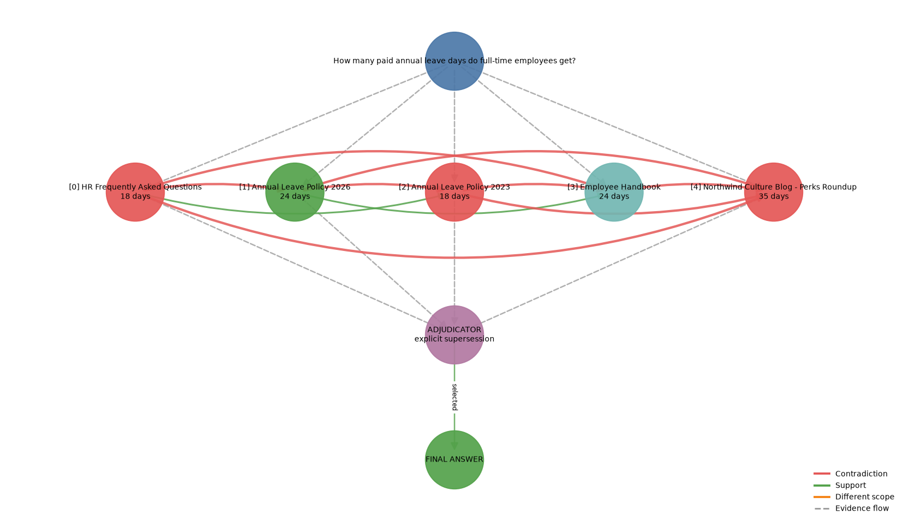

# VeriRAG: conflict-aware retrieval-augmented generation


Standard RAG asks which passages are relevant and hands them to a generator.
That is not enough when the retrieved sources disagree with each other. The
system also has to notice the disagreement, decide whether it is a real
contradiction or two claims about different things, and justify which source it
trusts.

VeriRAG adds that layer:

1. Retrieve candidates with dense and BM25 retrieval, fused by reciprocal rank
   fusion.
2. Rerank with a cross-encoder.
3. Extract one structured claim per passage.
4. Type every claim pair as SUPPORT, CONTRADICTION, DIFFERENT_SCOPE or
   IRRELEVANT.
5. Adjudicate contradictions on an explicit priority ladder: trusted
   supersession, then source authority, then recency, then relevance.
6. Generate a cited answer from the surviving evidence and expose the evidence
   graph.

The adjudicator is conditionally routed. If no contradiction exists that stage
is skipped rather than paying for a model call with nothing to decide.



*Adjudication trace for "How many paid annual leave days do full-time employees
get?" Green is the selected claim, red the rejected ones.*

## What the benchmark shows

The ablation is the headline, not the top-line score, because it changes one
component while holding retrieval fixed.

| Answer accuracy | Overall | 95% CI | clean | contradictory | outdated | noisy |
|---|---:|:--:|---:|---:|---:|---:|
| Vanilla RAG (dense only) | 0.469 | [0.31, 0.66] | 1.000 | 0.250 | 0.250 | 0.375 |
| **VeriRAG** | **1.000** | [0.89, 1.00] | 1.000 | 1.000 | 1.000 | 1.000 |
| no reranker | 0.969 | [0.91, 1.00] | 1.000 | 0.875 | 1.000 | 1.000 |
| no adjudicator | 0.719 | [0.56, 0.88] | 1.000 | 0.500 | 0.375 | 1.000 |
| recency-only adjudicator | 0.719 | [0.56, 0.88] | 1.000 | 0.250 | 0.625 | 1.000 |

Reading this honestly:

- **Adjudication carries the result.** Removing it costs 28 points overall, and
  the damage lands where predicted: conflicting questions fall from 1.000 to
  0.500, outdated ones from 1.000 to 0.375.
- **Recency alone is not a trust model.** The corpus contains a marketing blog
  that is the newest document and factually wrong, so a newest-wins policy
  collapses to 0.250 on the contradictory split. That is a predicted failure
  reproduced, which is a stronger result than another win.
- **The 1.000 is a controlled-regression result, not a generalisation claim.**
  32 synthetic questions over 9 planted documents, with a deterministic
  extractor whose property ontology was written for this corpus. The bootstrap
  interval already says a perfect score on n=32 supports only a lower bound of
  0.89.

Per-question output is written to `evaluation/results.csv`, aggregates to
`evaluation/summary.csv`.

## Architecture

```text
                        USER QUESTION
                              |
              +---------------+---------------+
              |                               |
         Dense retrieval                 BM25 retrieval
              |                               |
              +---------------+---------------+
                              |
                    Reciprocal Rank Fusion
                              |
                           Reranker
                              |
                        top-5 evidence
                              |
                  Agent 1: EVIDENCE ANALYST
                 passage -> structured claim
                              |
                  Agent 2: CONFLICT DETECTOR
        SUPPORT / CONTRADICTION / DIFFERENT_SCOPE / IRRELEVANT
                              |
                     contradiction found?
                         /          \
                       NO            YES
                       |              |
                       |      Agent 3: ADJUDICATOR
                       |      trusted supersession > authority
                       |        > recency > relevance
                       |              |
                       +------+-------+
                              |
                       ANSWER GENERATOR
                              |
            Answer + citations + confidence + evidence graph
```

DIFFERENT_SCOPE is what stops the system inventing conflicts. "Interns get 12
days" and "full-time employees get 24 days" differ numerically but are jointly
satisfiable, so scope disjunction is checked before values are compared.

## Quick start

```bash
pip install -r requirements.txt

python -m unittest discover -s tests -v      # 15 regression tests
python -m evaluation.evaluate --ablation     # benchmark, no API key needed
streamlit run app.py                         # demo UI
```

Run everything from the project root, the directory containing `config.py`.

### With a real provider

```bash
export GROQ_API_KEY=...                      # or GOOGLE_API_KEY / OPENAI_API_KEY / ANTHROPIC_API_KEY
python -m evaluation.evaluate --provider groq --strong-baseline
```

A `.env` file in the project root works too. Real environment variables take
precedence over it.

Provider APIs are called directly over `urllib`; no SDKs are required. Agent
output is schema-validated and falls back to deterministic logic on malformed
output or provider failure, so the evaluator reports a backend mix per system
and refuses to treat a run as a provider result when most stages fell back.

## Configuration

Everything tunable lives in `config.py` and is overridable by environment
variable. Values below are defaults.

**Provider**

| Variable | Default | Notes |
|---|---|---|
| `VERIRAG_LLM_PROVIDER` | `offline` | `groq`, `gemini`, `openai`, `anthropic`, `offline` |
| `GROQ_MODEL` | `openai/gpt-oss-120b` | Provider model lists change; check yours if a call 404s |
| `GEMINI_MODEL` | `gemini-2.0-flash` | |
| `OPENAI_MODEL` | `gpt-4o-mini` | |
| `ANTHROPIC_MODEL` | `claude-sonnet-4-5` | |
| `VERIRAG_TEMPERATURE` | `0.0` | |
| `VERIRAG_MAX_TOKENS` | `1200` | |
| `VERIRAG_TIMEOUT` | `60` | Seconds per request |
| `VERIRAG_USER_AGENT` | `VeriRAG/1.0 ...` | Some providers sit behind Cloudflare and reject the default urllib agent |
| `VERIRAG_RATE_LIMIT_RETRIES` | `6` | Waits the delay the provider asks for |
| `VERIRAG_MIN_CALL_INTERVAL` | `0` | Seconds between calls. Set to 5 on a free tier with a per-minute token cap |

**Retrieval**

| Variable | Default | Notes |
|---|---|---|
| `VERIRAG_EMBEDDING_MODEL` | `sentence-transformers/all-MiniLM-L6-v2` | Falls back to TF-IDF+SVD if unavailable |
| `VERIRAG_RERANKER_MODEL` | `cross-encoder/ms-marco-MiniLM-L-6-v2` | Falls back to lexical scoring |
| `VERIRAG_CHUNK_SIZE` | `70` | Words. Small so each policy section is its own chunk |
| `VERIRAG_CHUNK_OVERLAP` | `20` | Words |
| `VERIRAG_DENSE_TOP_K` | `10` | Dense candidates before fusion |
| `VERIRAG_BM25_TOP_K` | `10` | Sparse candidates before fusion |
| `VERIRAG_HYBRID_TOP_K` | `10` | Fused candidates passed to the reranker |
| `VERIRAG_RERANK_TOP_K` | `5` | Final evidence window |
| `VERIRAG_VANILLA_TOP_K` | `5` | Matched to the above so the control is not penalised |
| `VERIRAG_RRF_K` | `60` | RRF damping constant |

**Adjudication**

| Variable | Default | Notes |
|---|---|---|
| `VERIRAG_ADJ_MARGIN` | `0.05` | Below this margin the rules-only adjudicator abstains rather than guessing |

Source authority tiers are a dict in `config.py` rather than an environment
variable, because changing them changes the trust model rather than tuning it.

The two settings most worth changing during evaluation are
`VERIRAG_RERANK_TOP_K`, which controls how much distractor evidence enters the
window, and `VERIRAG_MIN_CALL_INTERVAL`, which is what makes a free-tier
provider run complete without falling back to rules.

## Backend conditions

Retrieval results depend on which backends are installed, which is not a
footnote: it changed a published number here. An earlier version shipped a
hand-written BM25 fallback described as a drop-in for `rank_bm25`. It ranks
chunks differently on this corpus, and the difference propagates far enough to
flip a benchmark item, which is why the no-reranker ablation used to read as an
exact tie. That fallback is deleted; `rank_bm25` is now required.

`summary.csv` records the condition that produced every row: provider, model,
embedder backend, reranker backend, provider errors and extraction backend mix.
`embedder=tfidf-svd, reranker=lexical` is a separate backend condition, not a
lower bound. The table above was produced with `rank_bm25` and `faiss` present
and sentence-transformers absent.

## Open experiments

Stated here rather than buried, because they are the first two questions a
reviewer asks.

**The strong single-call baseline.** The obvious objection to a staged pipeline
is: why not hand five passages plus their metadata to one capable model and tell
it to prefer authoritative sources? `pipeline/strong_baseline.py` implements
exactly that, with the same retrieval, the same reranked top-5, full source
metadata and the same priority order in its prompt. It needs a real provider and
has not been run. Either outcome is a result: if the staged pipeline wins, the
architecture is justified against its strongest objection; if it ties, the
honest conclusion is that the value is auditability rather than accuracy.

**The transformer backend row.** The table was produced without
sentence-transformers, so the embedder was TF-IDF+SVD and the reranker lexical.
Reproducing it with the full stack is one command and is the remaining
verification step.

## Why the offline backend exists

`VERIRAG_LLM_PROVIDER=offline`, the default, is a deterministic control
condition rather than a performance floor. It uses rule-based property
extraction, rule-based pairwise relation typing, and deterministic adjudication
from explicit metadata and authority priors.

That makes the project runnable with no API key, and separates two questions
that are usually conflated: whether the conflict-aware architecture works on the
controlled benchmark, and whether a given model improves on the deterministic
implementation. The table above answers only the first.

## Repository layout

```text
config.py                     every tunable, in one file
app.py                        Streamlit demo
data/documents/               9-document controlled corpus
rag/
  loader.py                   frontmatter and metadata parsing
  chunker.py                  paragraph-aware overlapping chunks
  embeddings.py               sentence-transformers, TF-IDF+SVD fallback
  vector_store.py             FAISS, numpy fallback
  bm25.py                     rank_bm25
  hybrid_retriever.py         RRF fusion
  reranker.py                 cross-encoder, lexical fallback
agents/
  llm.py                      provider client, JSON repair, rate limiting
  evidence_analyst.py         structured claim extraction
  conflict_detector.py        pairwise relation typing
  adjudicator.py              conflict resolution
  generator.py                grounded answer, vanilla generator
pipeline/
  verirag.py                  full conditional pipeline
  vanilla_rag.py              dense-only control
  strong_baseline.py          single-call conflict-aware LLM control
evaluation/
  questions.json              32 benchmark questions
  metrics.py                  scoring and bootstrap intervals
  evaluate.py                 harness and ablations
tests/test_regressions.py     15 regression tests
visualization/evidence_graph.py
```

## Evaluation definitions

Scoring is deterministic rather than using an LLM judge, which on 32 items would
add a second source of error harder to audit than the thing being measured.

- **Answer accuracy**: the expected value appears in the system's primary
  assertion, not merely inside its disclosure of a rejected source.
- **Abstention recall** and **false-abstention rate** are reported separately,
  so a system that never abstains cannot look good because most questions are
  answerable.
- **Primary gold-source rate** and **gold-citation hit rate** are separate,
  because a conflict explanation legitimately cites rejected sources too.
- **Distractor-value rate** counts a planted wrong value only when the answer is
  also wrong. Naming a value you rejected is transparency, not error.
- **95% intervals** are percentile bootstrap over 10k resamples with a fixed
  seed, with a Wilson interval for degenerate all-correct samples.

## Benchmark design

32 questions over the planted corpus, ground truth defined from the documents
and their metadata rather than outside-world facts.

| Condition | n | Purpose |
|---|---:|---|
| clean | 8 | one relevant answer, no conflict expected |
| contradictory | 8 | authority must beat naive recency |
| outdated | 8 | recency or explicit supersession matters |
| noisy | 8 | distractors, including 5 unanswerable items requiring abstention |

## Limitations

1. Synthetic corpus of 9 documents and 20 chunks: enough to test mechanics, not
   generalisation.
2. n=32, so one item moves the score about 3 points. Hence the intervals.
3. The offline extractor recognises properties present in this policy corpus. It
   is transparent and testable but is not a general semantic parser, and the
   1.000 should be read in that light.
4. Authority tiers are a design assumption, not a learned trust model.
5. The diagnostic evidence score is hand-tuned, not calibrated probability.
6. The five-passage evidence window is benchmark-aware and should be retuned on
   external data.
7. Vanilla-vs-full is not a single-component ablation: vanilla is dense-only.
   Use the no-adjudicator and recency-only rows for clean isolation.
8. Pairwise conflict detection is O(n^2). Fine at top-5, larger evidence sets
   need pruning or clustering.
9. Temporal and scope reasoning is shallow: no interval arithmetic, no
   jurisdictional exceptions, no multi-hop revision chains.
10. Provider integrations are exercised but not benchmarked end to end.
11. The system adjudicates evidence, it does not establish truth. If every
    retrieved source is wrong, good adjudication still produces a wrong answer.

## Future work

- Run the strong single-call baseline and the transformer backend row.
- Evaluate on an external conflict benchmark rather than only this corpus.
- Replace rule-based conflict typing with a calibrated NLI model and report
  per-backend precision and recall on pair typing.
- Add query decomposition for multi-part questions.
- Learn or externally verify source trust instead of hand-set tiers.

## Related work

- Cattan et al., *DRAGged into Conflicts: Detecting and Addressing Conflicting
  Sources in Search-Augmented LLMs*, arXiv:2506.08500, COLM 2025.
- *From Facts to Conclusions: Integrating Deductive Reasoning in
  Retrieval-Augmented LLMs*, arXiv:2512.16795.
- Chan et al., *ChatEval: Towards Better LLM-based Evaluators through
  Multi-Agent Debate*, ICLR 2024.

`AUDIT.md` documents the defects found in this codebase and what changed,
including several evaluation metrics that were inflating results and were
rewritten to be stricter.

## License

MIT, see `LICENSE`.
